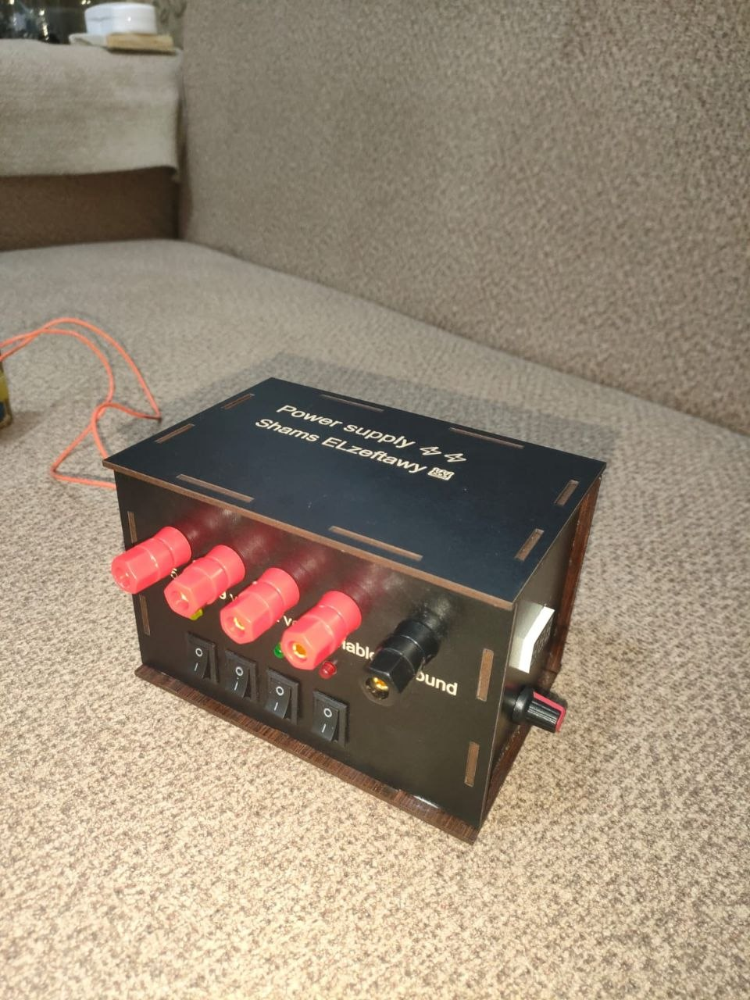

# Adjustable Power Supply ⚡🔌

A practical Adjustable Power Supply designed to provide multiple DC output voltages for electronics testing and small circuit projects.

This power supply provides fixed 5V and 12V outputs, along with a variable voltage output that can be adjusted depending on the circuit needs.

It also includes a display screen that shows the variable output voltage value, making it easier to monitor the output while working.

One of the special features of this project is the battery backup system, which allows the power supply to keep working even if the main power is disconnected.

> Fixed outputs, adjustable voltage, live display, and backup power — all in one supply. 🔥

## Project Preview 📸

## Watch It in Action 🔥

Here is a short video showing the power supply while operating 👇

- 🎥 [Power Supply Demo Video](https://drive.google.com/file/d/1I_kijyBrgZVQwHF3X_lJ46thLFHhkbEV/view?usp=drivesdk)

## Features

- Fixed 5V DC output
- Fixed 12V DC output
- Adjustable DC output voltage
- Display screen for showing the variable voltage value
- Battery backup operation
- Useful for testing and powering electronic circuits
- Practical design for electronics lab use

## Output Voltages

| Output Type | Voltage | Description |
|---|---|---|
| Fixed Output | 5V | Used for low-voltage electronic circuits and modules |
| Fixed Output | 12V | Used for circuits and devices that need 12V supply |
| Variable Output | Adjustable | Can be changed depending on the required voltage |
| Backup Power | Battery | Keeps the system running when the main power is off |

## How It Works

The power supply takes the main input power and converts it into stable DC outputs.

It provides two fixed outputs, 5V and 12V, which can be used directly with different electronic components.

The variable output can be adjusted manually, and its value is displayed on the screen in real time.

If the main power is disconnected, the battery backup allows the system to continue operating without stopping.

## Applications

- Electronics lab testing
- Arduino and microcontroller projects
- Sensor and module testing
- Small DC circuit experiments
- Prototyping and debugging
- Backup-powered low-voltage systems

## Project Goal

The goal of this project is to build a simple, practical, and reliable power supply that can support different electronics projects by providing fixed and variable DC voltages with a backup battery feature.
